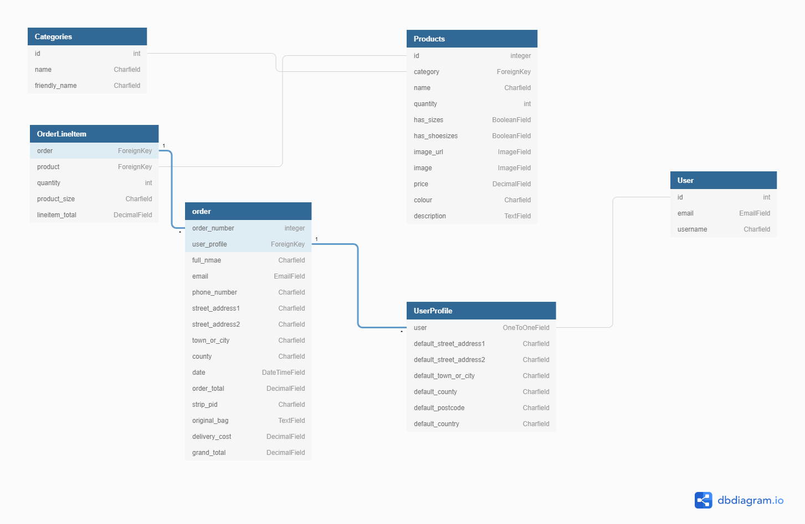

# Stay Fit

The live website can be viewed [here](https://stayfit2022.herokuapp.com/)

# Table of contents
1. [Introduction](#introduction)
2. [UX](#UX)
    * [User Stories](#User-Stories)
    * [Development Planes](#development-planes)
        * [Strategy](#Strategy)
         * [Skeleton](#Skeleton)
            * [Wireframes](#Wireframes)
            * [Database Schema](#Database-Schema)
        * [Structure](#Structure)
            * [Existing Features](#Existing-Features) 
            * [Features Left To Implement](Feature-Left-To-Implement)
    * [Design](#Design)
        * [Typography](#Imagery)
        * [Imagery](#Imagery)

3. [Technolgies Used](#Technologies-Used)        
4. [Testing](#Testing)
5. [Web Marketing](#web-Marketing)
6. [Issues and bugs fixed](#issues-and-bugs-fixed)
7. [Deployment](#Deployment)
    * [Deployment Steps](#Deployment-Steps) 
    * [Making a clone to run locally](#Making-a-clone-to-run-locally)
    * [How to Fork the respository](#How-to-Fork-the-Respository)
8. [Languages Used](#languages-used)
9. [Credits](#Credits)
    * [Media](#Media)
    * [Content](#Content)
    * [Code](#Code)
10. [Acknowledgements](#Acknowledgements)

---

# INTRODUCTION

Stay Fit is a eCommerce website where can be find some of equipments, sportwears, for fitness lovers. Users can views all products and all special offers that the website provides. They can view in detail the product that they're interested, add multiple time products in their basket, see the total before the checkout, enter their personnal information. Users can create an account and see their profile with all personal information.

There are many other site features which will be discussed in depth later on in this document.

This is the last of five milestone projects that the developer is required to complete as part of their full web development course at the Code Institute.

# UX

## User Stories

| User Story ID  | As a/an  | I want to be able to...  | So that I can... |
|---|---|---|---|
| Viewing Products & Navigation |
| 1  | User/Shopper | select and view individual products | view a larger image of product, description, price, review, and a purchase option. |
| 2  |   | be able to add, edit quantity and remove items from my bag | buy them if after browsing. |
| 3  |   | view a specific category of products | quickly find products I'm interested in without having to search through all products. |
| 4  |   | select and view individual product details | view a larger image of product, description, price, review, and a purchase option. |
| Registration and Accounts |
| 5  | User/Shopper | set up an account | I can create an account to store my details such as purchase history and address. |
| 6  |   | recover my account if password forgot  | gain access to my account. |
| 7  |   | have a personalized user profile | view my personal order history and order confirmations, and save my payment and address information |
| 8  |   | login and logout functionality | I can gain access to my account. |
| Searching products |
| 9  | User/Shopper | search for specific products | find products I am interested in buying. |
| 10  |   | see the number of results in a search that I have performed | easily see how many products are available. |
| 11  |   | sort the products based on price, name, category and rating  | better identify items that I would like to buy. |
| Checkout  |
| 15  | Shopper | view the full list of all products in my basket with prices and subtotal/total  | I can ensure that I have everything in my basket that I wanted. |
| 16  |   | enter my address and payment details for purchase | pay for items and have them delivered to the correct address. |
| 17  |   | easily select the correct size | ensure I have ordered the right size for my project. |
| 18  |   | adjust the number of products to buy | update the order without going back to the product page. |
| 19  |   | pay for my items in a manner that is secure and familiar | be sure that my card details and payment are handled securely. |
| 20  |   | remove items from my basket | I can ensure I am paying for only products that I want. |
| 21 |   | get a confirmation email of my purchase | be reassured that my purchase has gone through and is correct. |
| Admin/Management  |
| 22  | Store owner/Admin | login and logout to the site administration | manage my site and secure the site when I logout  |
| 23  |   | navigate through Product management | add a product directly from the website |
| 23  |   | update a product | have the ability to change product details, price, availability, and images. |
| 24  |   | delete a product | ensure my site is up to date and remove items no longer on sale. |
| 24  |   |  see how products are performing | see which products are performing best. |

# Wireframes
The wireframes were created using [Adobe XD](https://www.adobe.com/uk/products/xd.html) and can be found in pdf form in [wireframes](static/docs/images/wireframes).

#### **Desktop view**
- [Home]()
- [Register]()
- [Login]()
- [Profile-Orders]()
- [Products]()
- [Product-Detail]()
- [Add-Product-To-Bag]()
- [Processing-Payment]()
- [Checkout]()
- [Bag]()
- [Confirmed-Order]()

#### **Mobile view**

- [Home]()
- [Register]()
- [Login]()
- [Profile]()
- [Orders]()
- [Edit-Profile]()
- [Products]()
- [Product-Detail]()
- [Add-Product-To-Bag]()
- [Processing-Payment]()
- [Checkout]()
- [bag]()

# **Database Schema**

- [SQLite](https://www.sqlite.org/index.html)
    - Cloud based database to hold the product, user, order and blog fields.
- [Postgres](https://www.postgresql.org/)

The Database schema is below

# **Existing Features**

- **Site Navigation**

The navigation bar displays different links depending on whether the user is logged in, logged out or a super user.

| Link | Not logged in  | Logged in | Logged in as super user |
|---------------|---------------|---------------|-------------|
| Home | &#10003;| &#10003; | &#10003; |
| Log In  | &#10003;  | &#10007;  | &#10007;  |
| Register | &#10003;  | &#10007;  | &#10007;  |
| Profile  | &#10007;  | &#10003;  | &#10003;  |
| Log Out  | &#10007;  | &#10003;  | &#10003;  |
| Search  | &#10003;  | &#10003;  | &#10003;  |
| Add Product | &#10007; |&#10007;  |  &#10003; |

# **Features Implemented**

- **Create Profile**
    - Users are able to:
        - Create a profile to save their orders and personal information
        - Confirm their details are correct via email verification
        - Store details for faster checkout

- **Log in to Profile**
    - Users are able to:
        - Log in to profile to see their orders and personal information
        - Edit personal information if required

- **Products Page**
    - Users are able to:
        - See the products for sale on the site
        - Sort products by A-Z, Name, Category, Price and Rating
        - See the number of all products
        - See the name, category, colour, price and rating of product

    - Super users are able to:
        - Edit and delete products

- **Product Details Page**
    - Users are able to:
        - Click the products to find out more information including
        - Name, Size (if has size), Shoesize (if has shoesize), colour, price, SKU, category
        - Add products to bag to buy
        - Find out the needle size of their required product and convert to local using the sizing guide

    - Super users are able to:
        - Add, edit and delete products

- **Products Management**
    If the user is a super user they can:
        - Add a product (inc adding image)
        - Edit a product
        - Delete a Product

- **Bag**
    - Users are able to:
        - Adjust number of products in bag if they require
        - Find out delivery costs
        - Find out how much more they need to spend to get free delivery
        - Clearly see the total of their items by quantity and grand total

- **Checkout**
    - Users can:
        - Save time as personal details pulled from profile page if user is logged in
        - Save their delivery information to their profile
        - Clearly see how much they will be charged for their items and delivery

- **Navigation**

Header

- All users can:
  - Navigate to home, products, bag pages

- Users logged in can access:
  - Profile pages

- Users not logged in can:
  - Access log in and register pages

[Go to top](#introduction)

# **Features Left To Implement**

- I would like to implement a feature where if users log out of the site with items in their bags the items would be there upon log in again. Currently this is not the case.
- A chat bot where users can ask questions on the site.
- The ability to add many filters to their search criteria eg colour, category.
- The ability for users to change their username.
- The ability to view, add comments, edit and delete their own blog posts.
- A star rating or upvote functionality for the products and blog posts.

# **Responsive Design**

The site was designed to be mobile first as more users are using their handheld devices to shop online but this has been adapted to allow a great experience for desktop users also. 

# **Defensive Design**

- **Form Validation**
  - Form validation has been added to every form to ensure all required information is included before submitting.
  - If incorrect data is input a warning text appears to advise the user how to continue

- **Default Image if none added**
  - In the event that a product is added without an image a default image [noimage](media/product_images/noimage.png) will be added however this is unlikely due to form validation.
- **Unauthorised Attempts**
  - An error is launched if the user attempts to visit a part of the site where they are not authorised 
- **@login_required**
  - @login_required decorator added to restrict access to certain pages.
      - If a logged-out user tries to access a restricted page, they will be redirected to the login page.
      - Only authorised users may perform certain actions: Eg add, edit, delete product
- **Bag**
  - Validation ensures a minimum of 1 product and maximum of 99 products is added to the bag.
  - Error message appears if user tries to add negative numbers of items "Value must be greater than or equal to 1"
  - Error message appears if user tries to add numbers above 99 "Value must be less than or equal to 99"

[Go to top](#introduction)

# **Design**

1. Typography

    The fonts were chosen to complement one another and also give the aesthetic to the website: [Rubik Wet Paint](https://fonts.google.com/specimen/Rubik+Wet+Paint?query=Rubik+Wet+Paint) used for all Headings and ['Roboto Serif', sans-serif](https://fonts.google.com/specimen/Roboto+Serif?query=roboto) used for the rest of body, as a contrasting font to help the cursive stand out and allow for extra readability when more information given.

2. Colour Scheme

3. Imagery
    * The main image used in the home page was originally obtained from [Unsplash](https://unsplash.com/)
    * All images used in this site was originally obtained from [Aliexpress](https://best.aliexpress.com/?af=2058828&cn=6814&cv=14000&dp=102cc0e598892ed4a074a0e1a788d9&aff_fcid=b1233b7233a7481bbf082a79c1a2a898-1649256468231-01328-_ALwFAx&tt=CPS_NORMAL&aff_fsk=_ALwFAx&aff_platform=portals-tool&sk=_ALwFAx&aff_trace_key=b1233b7233a7481bbf082a79c1a2a898-1649256468231-01328-_ALwFAx&terminal_id=f18636dfae2f448d8bb88a9965502843&afSmartRedirect=y)

[Go to top](#introduction)

# **Testing**

Testing information can be found in a separate [testing file](https://github.com/Georgette-Lumbe/stay_fit/blob/main/TESTING.md).

# **Web Marketing**

* Facebook Page

# **Issues and bugs fixed**

The developper met some issues during the development of the website, below are the issues, bugs and solutions that the developer has encountered:

1. Heroku Login

    * When trying to login to heroku via the workspace, the developper get this error on the window `IP Address Mismatch on signing into Heroku CLI` and find solution on [this post](https://stackoverflow.com/questions/63363085/ip-address-mismatch-on-signing-into-heroku-cli) in stack Overflow. The developer typed `heroku login -i` to the workspace and then logged in.

2. Deployed to Heroku

    * When trying to push the code to Heroku master, the developper get this error `error: src refspec master does not match any`, the developper find the solution to [this post](https://code-institute-room.slack.com/archives/C7HS3U3AP/p1629563663371100?thread_ts=1629559227.368300&cid=C7HS3U3AP) on Slack. 
    * When the site was deployed, the developper get this error `An error occurred in the application and your page could not be served. If you are the application owner, check your logs for details. You can do this from the Heroku CLI with the command heroku logs --tail`, for resolving this, the developper deplaced the Procfile to the root and updated the Procfile content which had a spelling mistake.

3. Load products data

    * When trying to load products data by using: `python3 manage.py makemigrations --dry-run`, `python3 manage.py migrate --plan`, `python3 manage.py loaddata products`, the code was breaking. And I get this error: `django.db.utils.OperationalError: Problem installing fixture '/workspace/stay_fit/products/fixtures/products.json': Could not load products.Product(pk=1): no such column: colour`.

    * I get a help from Ger_ci and follow these steps: 
        - `python3 manage.py migrate products zero`
        - `python3 manage.py makemigrations`
        - `python3 manage.py migrate`
        - `python3 manage.py loaddata categories`
        - `python3 manage.py loaddata products`

4. Sign Up to aws amazon console

    * 

5. Stripe Currency

    * The developper set the currency as EURO in settings.py and he gets this error which was usefull to know: `InvalidRequestError at /checkout/
Request req_aPjY4IbnYrI832: Invalid currency: euro. Stripe currently supports these currencies: usd, aed, afn, all, amd, ang, aoa, ars, aud, awg, azn, bam, bbd, bdt, bgn, bhd, bif, bmd, bnd, bob, brl, bsd, bwp, byn, bzd, cad, cdf, chf, clp, cny, cop, crc, cve, czk, djf, dkk, dop, dzd, egp, etb, eur, fjd, fkp, gbp, gel, gip, gmd, gnf, gtq, gyd, hkd, hnl, hrk, htg, huf, idr, ils, inr, isk, jmd, jod, jpy, kes, kgs, khr, kmf, krw, kwd, kyd, kzt, lak, lbp, lkr, lrd, lsl, mad, mdl, mga, mkd, mmk, mnt, mop, mro, mur, mvr, mwk, mxn, myr, mzn, nad, ngn, nio, nok, npr, nzd, omr, pab, pen, pgk, php, pkr, pln, pyg, qar, ron, rsd, rub, rwf, sar, sbd, scr, sek, sgd, shp, sll, sos, srd, std, szl, thb, tjs, tnd, top, try, ttd, twd, tzs, uah, ugx, uyu, uzs, vnd, vuv, wst, xaf, xcd, xof, xpf, yer, zar, zmw, usdc, ghs, eek, lvl, svc, vef, ltl`
    * So, the developper changed EURO to EUR.

6. Profile page

    * The developer was stuck with some points:
        - He created profiles app after the supersuser and one user was already created.
        - Each time that the superuser was trying to navigate through the profile page and tried to login ion the admin page, he got these errors: `RelatedObjectDoesNotExitat /admin/login/ - User has no userprofile`, `RelatedObjectDoesNotExitat /accounts/login/ - User has no userprofile`, and `Page not found`
        - With the help of Oisin_ci, the developer created new superuser and new user register, and delete all the old superuser and user.

7. Migrations

    * The developper met this error: `You have 2 unapplied migration(s). Your project may not work properly until you apply the migrations for app(s): checkout. Run 'python manage.py migrate' to apply them.`
    * But each time that he tried to makemigrations and migrate, he get an another error `sqlite3.OperationalError: no such column: "product_weight`
    * With the help of Oisin_ci, the developer fix this bug like this: 
        - Run python3 manage.py migrate checkout zero
        - Run python3 manage.py migrate profiles zero
        - Delete some migrations files: in checkout app: 0001_initial.py, 0002_auto_..., and 0003_remove... and in profile app: 0001_initial.py
        - Run python3 manage.py makemigrations --dry-run
        - Run python3 manage.py makemigrations
        - Run python3 manage.py migrate --plan
        - And then Run python3 manage.py migrate

8. Pylint

    * To avoid many errors as "class has no member object", the developper via [this post](https://stackoverflow.com/questions/58255016/class-has-no-objects-member) was able to fix those errors. He changed the settings.JSON contents with this: `"python.linting.pylintArgs": [
    "--load-plugins=pylint_django",
    "--errors-only"],`
    * The above fix had to another error : "django was not configured. For more information run pylint ---load-plugins=pylint_django --help-msg=django-not-configured". And the developper visited [this post](https://stackoverflow.com/questions/65761250/pylint-django-raising-error-about-django-not-being-configured-when-thats-not-th)and this [video](https://www.youtube.com/watch?v=SXNLt6FRizc) to fix the problem.

[Go to top](#introduction)

# **Deployment**

This project was developed using [Gitpod IDE](https://gitpod.io) and pushed to Github using the in-built terminal. However, because Github can only host static websites it was necessary to deploy this project to Heroku because it is a compatible hosting platform for a back-end focused site like Trainees Portal.

This project was deployed using Heroku and stored in GitHub.

## Repository Creation

1. Navigate to [Github](https://github.com/).
2. Create a new repository by first clicking the green button labeled new on the top left of the screen.
3. Select the [Code Institute Full Template](https://github.com/Code-Institute-Org/gitpod-full-template) in the templates section.
4. Give the repository a name, in this case Trainees Portal.
5. Click the green 'Create Repository' button at the bottom of the page.
6. Inside the repository click the green 'gitpod' button to initialize your repository.
8. Future access to this workspace must be gained through gitpod workspaces, clicking the green button in gitpod again 
will initialize a new workspace.
9. Use the `git add .` command to add all modified and new files to the staging area.
10. Use the `git commit -m` command to commit a change to the local repository.
11. Use the `git push` command to push all committed changes to github.   

Before deploying the website to Heroku, the following five must be followed to allow the app to work in Heroku:

1.  Install `django-gunicorn`, `psycopg2` and `dj_database_url`, `cloudinary` in your workspace cli.

2. Create requirements.txt file that contains the names of packages being used in Python. It is important to update this file if other packages or modules are installed during project development by using the following command:

    - pip freeze --local > requirements.txt

3. Create Procfile that contains the name of the application file so that Heroku knows what to run. If the Procfile has a blank line when it is created remove this as this may cause problems.

4. Create env.py that conrtains all secret variables as DATABASE_URL, SECRET_KEY and CLOUDINARY_URL, this file is hidden.

5. Push these files to GitHub.

[Go to top](#introduction)

## Deployment Steps

Once the above steps are done, the website can be deployed in Heroku using the steps listed below:

1. Log into Heroku .
2. Click the New button.
3. Click the option to create a new app.
4. Enter the app name in lowercase letters.
5. Select the correct geographical region.
6. Click to create

## Add Heroku Postgres Database
1. Click the resources tab in heroku.
2. Under Add-ons search for heroku postgres.
3. Click on heroku postgres when it appears. 
4. Select the Hobby Dev-Free option in plans. 
5. Click submit order form.

## Manipulate the Workspace

1. 
2. 

## Setting up environment variables

1. 
2. 

## Connect Heroku app to Github repository

1. In heroku select the deploy tab.
2. Click github button.
3. Enter the repository name and click search.
4. Select the relevant repository and click connect
5. Select Main branch
6. Click on deploy branch 

## Enable automatic deployment:

1. Click the Deploy tab
2. In the Automatic deploys section, the main branch is enabled to deploy then click Enable Automation Deploys.

[Go to top](#introduction)

## Making a clone to run locally

It is important to note that this project will not run locally unless an env.py file has been set up by the user which contains the DATABASE_URL, SECRET_KEY and CLOUDINARY_URL which have all been kept secret in keeping with best security practices. 

1. Log into GitHub.
2. Select the [respository](https://github.com/Georgette-Lumbe/stay_fit).
3. Click the Code dropdown button next to the green Gitpod button.
4. Download ZIP file and unpackage locally and open with IDE. Alternatively copy the URL in the HTTPS box.
5. Open the alternative editor and terminal window.
6. Type 'git clone' and paste the copied URL.
7. Press Enter. A local clone will be created.

Once the project been loaded into the IDE it is necessary to install the necessary requirements which can be done by typing the following command.

    -pip install -r requirements.txt

## How to Fork the respository.

1. Log into GitHub.
2. In Github go to the [respository](https://github.com/Georgette-Lumbe/stay_fit).
3. In the top right hand corner click "Fork".

---

[Go to top](#introduction)

# **Technologies, frameworks and Libraries Used**

1. [Python](https://www.python.org/) 
    The following Python modules were used on this project:
    - asgiref==3.4.1
    - backports.zoneinfo==0.2.1
    - dj-database-url==0.5.0
    - Django==3.2.11
    - django-allauth==0.41.0
    - django-countries==7.2.1
    - django-crispy-forms==1.14.0
    - gunicorn==20.1.0
    - oauthlib==3.1.1
    - Pillow==9.0.0
    - psycopg2-binary==2.9.3
    - python3-openid==3.2.0
    - pytz==2021.3
    - requests-oauthlib==1.3.0
    - sqlparse==0.4.2
    - stripe==2.65.0
2. [Django](https://docs.djangoproject.com/en/3.1/)
    - Django was used as the main python framework in the building of this project.
3. [jQuery](https://jquery.com/)
    - This framework was used to create some of the site's interactive functions.
4. [Git](https://git-scm.com/)
  - Git was used for version control (commit to Git and push to GitHub).
5. [Gitpod](https://gitpod.io)
    - This project was built using Gitpod as the IDE.
6. [Github](https://github.com/)
    - Github was used for online version control and storing files and documents.
7. [Heroku](https://id.heroku.com/)
    - Heroku was used as a cloud-based platform to deploy this site.
8. [Google fonts](https://fonts.google.com/) 
    - The font styles used on this website were chosen from Google fonts.
9. [Bootstrap](https://getbootstrap.com/docs/4.4/getting-started/introduction/)
    - Various aspects of this website were structured using Materialize.
    - Bootstrap was used to make this website responsive
10. [Fontawesome](https://fontawesome.com/)
    - The icons used on this page were found in Fontawesome.
11. [Heroku Postgres](https://www.heroku.com/postgres)
    - Heroku was used as the database for this project in production mode after deployment to Heroku.
12. [Django Secret Key Generator](https://djecrety.ir/)
    - Djecrety was used to generate the secrect key for this app.   
13. [Balsamiq](https://balsamiq.com/)
    - The wireframes for this project were created using Balsamiq.
14. [Freeformatter- CSS beautifier](https://www.freeformatter.com/css-beautifier.html)
    - This was used to format the CSS stylesheet.
15. [Freeformatter- HTML formatter](https://www.freeformatter.com/html-formatter.html)
    - This was used to format each HTML page
16. [PEP8online](http://pep8online.com/)
    - PEP8 online was used to make sure all python code was pep8 compliant.
17. [Google DevTools](https://developers.google.com/web/tools/chrome-devtools) 
    - Google Dev Tools was extensively used throughout the project for various styling and testing purposes. Its lighthouse feature was used as one of the main testing tools for this project.
18. [Favicon.io](https://favicon.io/) 
    - This was used to create the site's favicon.
19. [Am I Responsive](http://ami.responsivedesign.is/)
    - This was used to test the responsiveness of the site and also to create the mock-up image presented at the start of this document.
20. - [Dbdiagram.io](https://dbdiagram.io/home)
    - Dbdiagram.io was used to create the Database Schema presented in this document.
21. [StackOverflow](https://stackoverflow.com/)
    - Stack Overflow was used as a general reference resource.
22. [JSHint](https://jshint.com/)
    - Used to detect errors in the JavaScript files
23. [W3C Markup Validator](https://validator.w3.org/)
    - Markup validation service for HTML5
24. [Jigsaw Validator](https://jigsaw.w3.org/css-validator/)
    - CSS3 Validation Service
25. [Wave](https://chrome.google.com/webstore/detail/wave-evaluation-tool/jbbplnpkjmmeebjpijfedlgcdilocofh)
    - Accessibility validation service.
26. - [Lighthouse](https://developers.google.com/web/tools/lighthouse)
  - Used to audit the site for quality and ensure responsiveness.
27. - [Coolors](https://coolors.co/)
  - Used to research and choose the colour scheme by comparing and contrasting similar colours in the generator.
28. [Stripe](https://dashboard.stripe.com/)
    - Used to implement the payment method

---

[Go to top](#introduction)

# **Languages used**

This project is primarily built using:

1. [HTML5](https://developer.mozilla.org/en-US/docs/Web/HTML)
  - Used as the main markup language for the website content.
2. [CSS3](https://developer.mozilla.org/en-US/docs/Web/CSS)
  - Used to style the individual webpages.
3. [JavaScript](https://developer.mozilla.org/en-US/docs/Web/JavaScript)
    - Used to show the questions through pagination and for the game play.
4. [Python 3](https://www.python.org/)
    - Used to run the site and database

# **Credits**

## Media

* The main image used in the home page was originally obtained from [unsplash](https://unsplash.com/)
* All images used in this site was originally obtained from [Aliexpress](https://best.aliexpress.com/?af=2058828&cn=6814&cv=14000&dp=102cc0e598892ed4a074a0e1a788d9&aff_fcid=b1233b7233a7481bbf082a79c1a2a898-1649256468231-01328-_ALwFAx&tt=CPS_NORMAL&aff_fsk=_ALwFAx&aff_platform=portals-tool&sk=_ALwFAx&aff_trace_key=b1233b7233a7481bbf082a79c1a2a898-1649256468231-01328-_ALwFAx&terminal_id=f18636dfae2f448d8bb88a9965502843&afSmartRedirect=y)

## Content

* All the products content was obtained from [Aliexpress](https://best.aliexpress.com/?af=2058828&cn=6814&cv=14000&dp=102cc0e598892ed4a074a0e1a788d9&aff_fcid=b1233b7233a7481bbf082a79c1a2a898-1649256468231-01328-_ALwFAx&tt=CPS_NORMAL&aff_fsk=_ALwFAx&aff_platform=portals-tool&sk=_ALwFAx&aff_trace_key=b1233b7233a7481bbf082a79c1a2a898-1649256468231-01328-_ALwFAx&terminal_id=f18636dfae2f448d8bb88a9965502843&afSmartRedirect=y)

## Code

* A large portion of this project's code was inspired and developed following the Code Institute's Boutique Ado walkthrough. This Code Institute tutorial was instrumental in the creation of this site.

* [CodeInstitute](https://codeinstitute.net/ie/full-stack-software-development-diploma/) Full Stack Developer Course

* [Bootstrap4](https://getbootstrap.com/docs/4.4/getting-started/introduction/) : Bootstrap library was used throughout the project mainly to make site responsive.

* Code inspiration taken from [CI Student Suzy Bee](https://github.com/suzybee1987/knit-happens).

* Stack overflow for may bugs as mentionne in the [issues and bugs fixed](#issues-and-bugs-fixed)

# **Acknowledgements**

* I would like to thank the entire slack community for being a source of support, knowledge and positive feedback throughout this project.

* I would like to thank the tutor support for their patience and guidance throughout the development of this project. In particular, I would like to thank scott_ci, Igor_ci, Ed_ci, Oisin_ci and Kasia. I really am immensely grateful and cannot thank each of them enough. 

* I would like to thank my own class cohorts for being supportive and helpful throughout the duration of the course. This particular channel provided a great deal of respite and also necessary feedback throughout the course which has proven invaluable for maintaining motivation. 

* Finally I would like to thank my husband Jimmy for constantly helping to test the project throughout its development, providing insightful suggestions. I would also like to thank Jimmy for his constant love, his ear to listen my ideas and his support throughout this course and for never allowing me to give up, this would not have been possible without him and I will always been grateful for everything he has done to make this possible.
---
[Go to top](#introduction)

