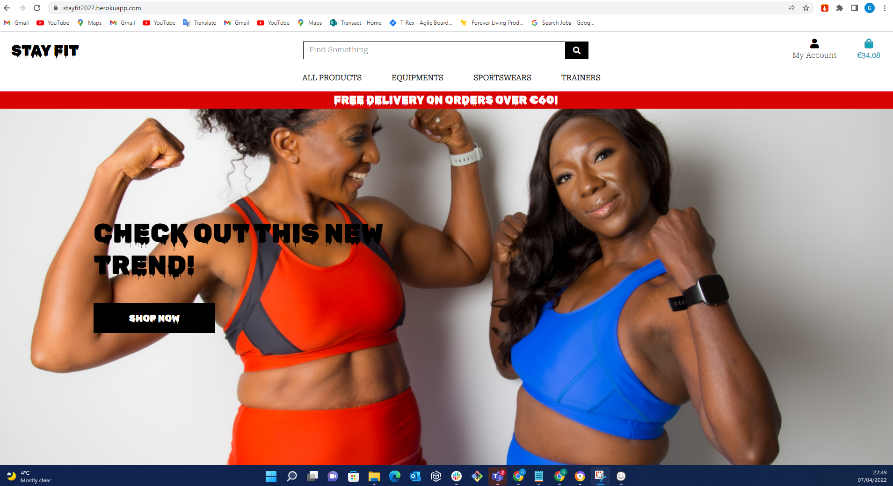
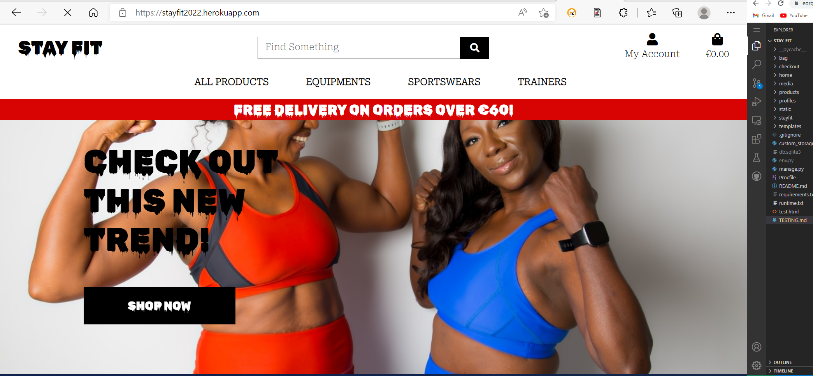

# Stay Fit - Testing

[Main README.md file](https://github.com/Georgette-Lumbe/stay_fit/blob/main/README.md)

[View live project](https://stayfit2022.herokuapp.com/)

[View website in GitHub pages](https://github.com/Georgette-Lumbe/stay_fit)

---

# Table of Contents

1. [Testing User Stories](#testing-user-stories "#Goto testing user stories")
2. [Manual Testing](#manual-testing "#Goto manual testing")

3. [Automated Testing](#automated-testing "#Goto automated testing")
    * [Code Validation](#code-validation "Goto code validation")
    * [Browser Validation](#browser-validation "Goto browser validation")
    * [Lighthouse Auditing](#lighthouse-auditing "Goto lighthouse auditing")

---

# Testing User Stories

| User Story ID  | As a/an  | I want to be able to...  | So that I can... |  | Pass/Fail |
|-------------------|-------------------|-----------------|-------------------|-------------------|---------------|
| Viewing Products & Navigation |
| 1  | User/Shopper | select and view individual products | view a larger image of product, description, price, and a purchase option. || Pass |
| 2  |   | be able to add, edit quantity and remove items from my bag | buy them if after browsing. || Pass |
| 3  |   | view a specific category of products | quickly find products I'm interested in without having to search through all products. || Pass |
| 4  |   | select and view individual product details | view a larger image of product, description, price, and a purchase option. || Pass |
| Registration and Accounts |
| 5  | User/Shopper | set up an account | I can create an account to store my details such as purchase history and address. || Pass |
| 6  |   | recover my account if password forgot  | gain access to my account. || Pass |
| 7  |   | have a personalized user profile | view my personal order history and order confirmations, and save my payment and address information || Pass |
| 8  |   | login and logout functionality | I can gain access to my account. || Pass |
| Searching products |
| 9  | User/Shopper | search for specific products | find products I am interested in buying. || Pass |
| 10  |   | see the number of results in a search that I have performed | easily see how many products are available. || Pass |
| 11  |   | sort the products based on price, name, category and rating  | better identify items that I would like to buy. || Pass |
| Checkout  |
| 15  | Shopper | view the full list of all products in my basket with prices and subtotal/total  | I can ensure that I have everything in my basket that I wanted. || Pass |
| 16  |   | enter my address and payment details for purchase | pay for items and have them delivered to the correct address. || Pass |
| 17  |   | easily select the correct size | ensure I have ordered the right size for my project. |
| 18  |   | adjust the number of products to buy | update the order without going back to the product page. || Pass |
| 19  |   | pay for my items in a manner that is secure and familiar | be sure that my card details and payment are handled securely. || Pass |
| 20  |   | remove items from my basket | I can ensure I am paying for only products that I want. || Pass |
| 21 |   | get a confirmation email of my purchase | be reassured that my purchase has gone through and is correct. || Pass |
| Admin/Management  |
| 22  | Store owner/Admin | login and logout to the site administration | manage my site and secure the site when I logout  || Pass |
| 23  |   | navigate through Product management | add a product directly from the website || Pass |
| 23  |   | update a product | have the ability to change product details, price, availability, and images. || Pass |
| 24  |   | delete a product | ensure my site is up to date and remove items no longer on sale. || Pass |
| 24  |   |  see how products are performing | see which products are performing best. || Pass |

[Go to top](#testing-user-stories "#Goto testing user stories")

# Manual Testing

### **Manual Testing**

#### **Devices Used**
The site was tested on these devices:
- iPhone 12 mini
- iPhone XR
- Huawei P30 Lite
- Galaxy A20e
- iPhone SE 2020

#### **Navigation**
    - all users

| Feature        | Expected           | Testing  | Result | Pass/Fail |
| ------------- |-------------| -----|  ---------- | :----: |
| Home button    | To redirect to home page | Click the home button | Button navigates to home | Pass |
| Navbar links | Clicking All Products takes user to All Products page | Click All Products | Redirected to All Products page | Pass |
|  | Clicking category takes user to the specific category page | Click each category in turn | Redirected to specific category page | Pass |
|   | Click Bag takes user to Bag page | Click Bag | Redirected to Bag page | Pass |
|   | Clicking My account takes user to select login, logout, profile | Click My account |  | Pass |
|   | Searching using Search Bar displays the product in the products page | Type dumbbells in search bar | Redirected to Products page with all dumbbells shown | Pass |

#### **Navigation**
    - users logged in
|  Navbar links   | Clicking Profile takes user to their profile page | Click Profile | Redirected to Profile Page | Pass |
|  | Click Log Out logs out the user | Click Log Out | User logged out and redirected to Log In | Pass |

    - user not logged in

| Feature        | Expected           | Testing  | Result | Pass/Fail |
| ------------- |-------------| -----|  ---------- | :-----:|
| Navbar links | Click Log In redirects to log in page | Click Log In | User redirected to Log In Page | Pass |
|  | Click Register redirects to log in page | Click Register | User redirected to Register Page | Pass |

 [Go to top](#testing-user-stories "#Goto testing user stories")

#### **Home Page**
| Feature        | Expected           | Testing  | Result | Pass/Fail |
| ------------- |-------------| -----|  ---------- |:----:|
| Shop Now | Clicking the shop now button takes users to view all products | Click shop button | User redirected to the products page | Pass |
| Shopping Options | Clicking All products, Equipments, Trainers, and Sportswear Links lead to different parts of shop | Click All products, Equipments, Trainers, and Sportswear | Redirected to the relevant products in shop | Pass |

#### **Register Page**
| Feature        | Expected           | Testing  | Result | Pass/Fail |
| ------------- |-------------| -----|  ---------- | :-----:|
| Register functionality | Form validation for email requires `@` symbol |  Attempt to register without `@` in input field | Form validation requests valid email address | Pass |
| | E-mail Again value must be same as Email value | Attempt to register with incorrect email in email again input field | Form validation requests email address must match | Pass |
| | Username must be between 4 and 15 characters | Attempt to enter username with less than 4 characters | Feedback error displayed | Pass |
| | Username must be between 4 and 15 characters | Attempt to enter username with more than 15 characters | Form restricts the user from using more than 15 characters | Pass |
| | Password must be longer than 8 characters | Attempt to enter password with less than 8 characters | Form restricts the user from using less than 8 characters | Pass |
| | Register with new user and password to be logged in and redirected to Profile page | Enter email address, name, username, password and click register | New account registered and profile page shown | Pass |

#### **Log In Page**

| Feature        | Expected           | Testing  | Result | Pass/Fail |
| ------------- |-----------------| ----------|  ---------- | :----: |
| Log in functionality | Correct user/pass combination directs user to their profile page with name displayed in tab | Log in with correct username/password combination | Redirected to user profile page with name displayed in tab | Pass |
|   | Incorrect username/password combination shows error message | Attempt to log in with incorrect credentials | "The username and/or password you specified are not correct." error message appears| Pass |
| Link to Register | Redirect to Register page | Click link to register | Redirected to Register page | Pass |

#### **Profile Page**

| Feature        | Expected           | Testing  | Result | Pass/Fail |
| ------------- |-------------| -----|  ---------- | :----:|
| Personal Information | Personal information is visible if previously saved | Navigate to Profile page, view personal information | The personal information is visible in Personal Information section | Pass |
| | Personal information can be updated | Navigate to Profile page, change personal information, click update information. | The personal information is updated with the new details. | Pass |
| Order History | Order History is visible if order placed while logged in | Navigate to Profile page, view Order History Section | The Order History is visible | Pass |
| | Order information can be accessed by clicking order number | Navigate to Profile page, view Order History Section, click Order Number | Order Information is visible | Pass |

 [Go to top](#testing-user-stories "#Goto testing user stories")

#### **Products Pages**

##### **Products**
| Feature        | Expected           | Testing  | Result | Pass/Fail |
| ------------- |-------------| -----|  ---------- | :----:|
| All products visible | Products page shows all products | Open Products page and view products | Products visible  | Pass |
|  | Sorting by category, rating, price, name shows products from that particular category | Select to sort by each category | Products from each category successfully displayed | Pass |
| Pagination | View number of all products| Open Products page, view number of all products in the shop | All products are available on product page | Pass |
| Back to top | Redirected at the top of the page| Click Up arrow | Redirect at the top of products | Pass |

##### **Product Details**
| Feature        | Expected           | Testing  | Result | Pass/Fail |
| ------------- |-------------| -----|  ---------- | :----:|
| Product Details | Product description displayed for individual product | Open Product Detail page and view products | Product details visible | Pass |
| Add to bag | Clicking Add To Bag adds the product to the bag | Open Product Detail page click add to bag | Product available in bag | Pass |
|  | If product has sizes the Sizes field is required  | A size is already set as selected | Can't set this field without any size | Pass |
|  | If product has shoesize the shoesize field is required  | A size is already set as selected | Can't set this field without any size | Pass |

##### **Add Product**
| Feature        | Expected           | Testing  | Result | Pass/Fail |
| ------------- |-------------| -----|  ---------- | :----:|
| Add Products | Only admin is allowed to visit add product page | Log in as non-superuser and attempt to access /products/add/ | Redirect to home page, error message displayed "Sorry, only store owners can do that." | Pass |
| Form Validation | Required fields must be completed to add the product  | Attempt to add product without filling in a required field | Error message "Please fill in this field" | Pass |

##### **Edit Product**
| Feature        | Expected           | Testing  | Result | Pass/Fail |
| ------------- |-------------| -----|  ---------- | :----:|
| Edit Products | Only admin is allowed to visit edit product page | Log in as non-superuser and attempt to access /products/<item_id>/edit/ | Redirect to home page, error message displayed "Sorry, only store owners can do that." | Pass |
| Form Validation | Required fields must be completed to edit the product  | Attempt to edit product without filling in a required field | Error message "Please fill in this field" | Pass |

 [Go to top](#testing-user-stories "#Goto testing user stories")

#### **Bag**
| Feature        | Expected           | Testing  | Result | Pass/Fail |
| ------------- |-------------| -----|  ---------- | :----:|
| View Items | Correct products are in the bag | Add product to bag and check quantity and total are in the bag | Expected products are in the bag | Pass |
| Update Items | Update the number of a product in the bag and it will reflect in bag and price | Click pen Icon, Change number of product in bag and check quantity and total has updated | Total and quantity updated | Pass |
| Remove Items | Click remove for item to be removed from the bag | Click remove icon beside relevant product | Item removed from bag and notification to confirm this "Removed <item> from your bag" | Pass |

#### **Checkout**
| Feature        | Expected           | Testing  | Result | Pass/Fail |
| ------------- |-------------| -----|  ---------- | :----:|
| View Items | Correct products are in the checkout | Add products to bag, click Secure Checkout | Expected products are in the checkout product list | Pass |
| Form Validation | Required fields must be completed to complete  | Attempt to check out without filling in a required field | Error message "Please fill in this field" | Pass |

 [Go to top](#testing-user-stories "#Goto testing user stories")

# Automated Testing

## Code Validation

#### **HTML Validator**
HTML validator was used for all pages and only five minor erros  about the use of li, nav, div elements. 
- [Templates-html1](static/docs/images/validation/templates-html1.png)
- [Templates-html2](static/docs/images/validation/templates-html2.png)

#### **CSS Jigsaw**
CSS Jigsaw validation passed for all pages
- [checkout.css](static/docs/images/validation/checkout-css.png)
- [base.css](static/docs/images/validation/base-css.png)

#### **PEP8**
-  Checkout [signals](https://code-institute-room.slack.com/archives/C7HS3U3AP/p1642780620039300) imported but not used in problems tab however this is required as it is being accessed elsewhere so the problem can be ignored. 
- Settings.py, env import but unused

[With all Python files open](static/docs/images/validation/pep8.png) those are the only two issues.

#### **JSHint**
JavaScript JSHint validator passed for all pages
- [stripe_elements.js](static/docs/images/validation/stripe-elements-js.png)
- [product-page.js](static/docs/images/validation/jshint-back-to-top-js.png)

## Browser Validation

The site was tested on:
- Google Chrome
- Edge

1. Chrome

      

2. Edge

 

## Lighthouse Auditing

Lighthouse testing was completed on all pages of the site
- [Home](static/docs/images/validation/lighthouse-home.png)
- [Products](static/docs/images/validation/lighthouse-products.png)
- [Product Detail](static/docs/images/validation/lighthouse-product_detail.png)
- [Bag](static/docs/images/validation/lighthouse-bag.png)
- [Checkout](static/docs/images/validation/lighthouse-checkout.png)
- [Checkout Success](static/docs/images/validation/lighthouse-checkout-success.png)
- [Profile](static/docs/images/validation/lighthouse-profile.png)
- [Add Product](static/docs/images/validation/lighthouse-add-product.png)

The Lighthouse scores are quite good in my opinion and a lot of the warnings that appeared were due to things outside my control like external CSS, JS and JQuery libraries.

 [Go to top](#testing-user-stories "#Goto testing user stories")
